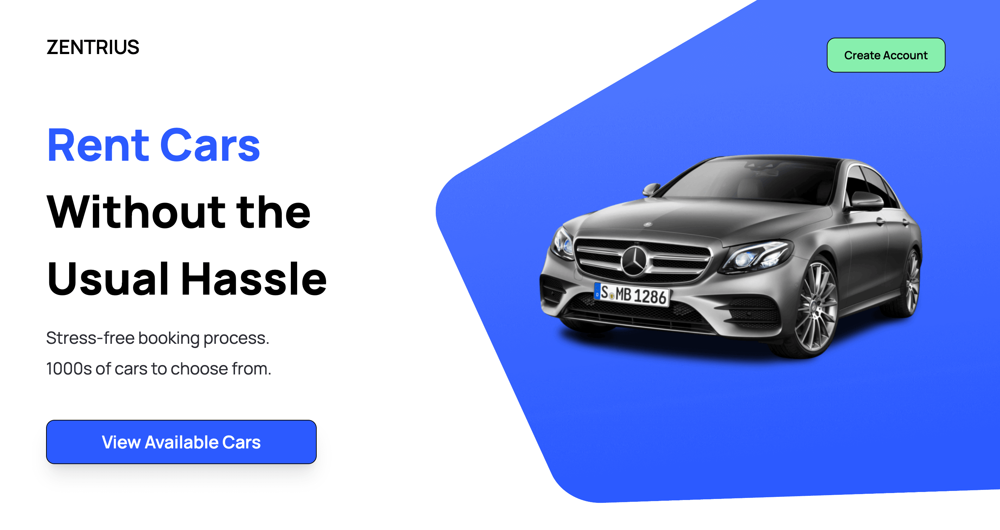

# Zentrius

> Zentrius - Car Rentals Without the Hassle

## TABLE OF CONTENTS

- [Description](#description)
- [Features](#features)
- [Tech Stack](#tech-stack)
- [Author Info](#author-info)

## DESCRIPTION

Zentrius is a car rental application that offers a seamless and hassle-free platform for users to find their perfect rental vehicle.

[Back To The Top](#zentrius)

## TECH STACK

- HTML5
- CSS3
- Tailwind
- JavaScript
- TypeScript
- Next.js
- React

[Back To The Top](#zentrius)

## FEATURES

👉 **Search Functionality**:

Built a Searchbar component that allows the user to search for cars by Car Brand and Car Model.

👉 **Custom Filters**

Explore a filtered catalogue of cars from all over the world, you can filter your results by Fuel Type and Year of Production.

👉 **Car Modals**:

When the user has found a car they're interested in, they can view more details about that car by clicking the 'View More' button that appears when they hover over it.

The Car Modal that appears after clicking the 'View More' button, includes details such as:

- City MPG
- Highway MPG
- Combined MPG
- Production Year
- Car Make
- Car Class

👉 **Sign Up Functionality**:

Users can sign up by entering a valid username, email and password into the provided Sign Up form.

👉 **Log In Functionality**:

After creating an account, users can log into their accounts using the provided Login form.

👉 **Sign Up and Login Form Validation**:

User emails and passwords must meet a certain set of criteria in order to be submitted successfully.

For example, email must include an '@' sign.

If the user's details do not meet the set criteria, then they are shown an error message informing them of the changes they need to make.

👉 **Animated Car Slideshow**:

After a set duration of time a new car image slides into place and replaces the previously shown image, the car slideshow is located within the site's Hero component.

👉 **Fully Mobile Responsive Design**:

The website has been designed with responsiveness in mind, ensuring an optimal user experience (UX) across various devices, including mobile.

👉 **Third-Party API**:

Used a third-party API to retrieve and present car images and relevant car data, displayed seamlessly through the app's Car Card and Car Modal components.

👉 **Server-Side Rendering**:

I have used Next.js to build this app, allowing the website to take advantage of server-side rendering, enhancing the performance of the site and providing a smoother experience for the user.

👉 **Pagination**:

Implemented pagination to improve user experience (UX) and improve page performance.

Pagination breaks the dataset into manageable chunks, making it easier for the user to navigate through the results and find their next car rental.

Below the currently displayed results, there is a 'Show More Cars' button that users can click to see additional results. Every time the user clicks 'Show More Cars', 6 more cars are shown.

👉 **TypeScript Types**:

Utilised TypeScript to provide robust typing and improve code quality, helping to prevent bugs.

[Back To The Top](#zentrius)

## Author Info

- Portfolio Website - [Brandon Guard](https://www.brandon-guard.com)

[Back To The Top](#zentrius)
